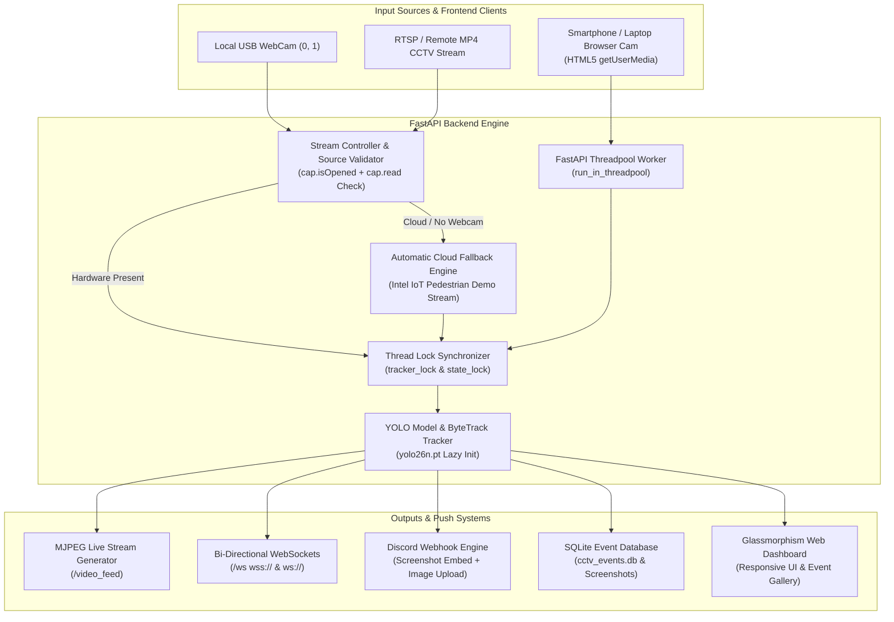

# 🛡️ AI CCTV Person Detection & Real-Time Security Sentinel


An enterprise-grade, production-stabilized real-time computer vision security monitoring system built with **FastAPI**, **Ultralytics YOLO**, **OpenCV Headless**, **ByteTrack**, **WebSockets**, and **SQLite**.

Designed for both **Local Hardware Execution** (physical USB webcams) and **Cloud Container Deployments (Render)** with zero-dependency fallback, non-blocking async architecture, synchronized persistent tracking, and mobile HTML5 camera streaming.

---

## 🏛️ End-to-End System Architecture



---

## 🌟 Complete Feature Matrix

### 🎥 1. Multi-Source Stream Engine & Cloud Fallback
- **Physical Webcam Support**: Detects and opens local USB webcams (`/dev/video0`, index `0`, `1`) when hardware exists.
- **Smart Source Validation**: Validates both `cap.isOpened()` AND reads the initial test frame (`cap.read()`) before rendering.
- **Automatic Cloud Fallback**: If physical webcams are absent (e.g., inside Render cloud containers), automatically transitions to a verified online CCTV demo stream without crashing or hanging.
- **Detailed Lifecycle Logging**: Structured Python `logging` captures selected source, resolution, fallback events, model readiness, and OpenCV errors.

### 📱 2. Sequential HTML5 Smartphone Camera Capture
- **Direct Browser Camera**: Streams smartphone (Android / iPhone) or laptop cameras via `navigator.mediaDevices.getUserMedia`.
- **Sequential Async Loop**: Replaces uncontrolled `setInterval` with an `async/await` processing loop (`capture frame -> encode -> POST /api/process-frame -> await response -> update UI -> 60ms delay`) featuring an 8-second `AbortController` timeout.
- **Zero Request Flood**: Ensures browser request rate naturally matches server processing capacity without backlogs.

### 🔒 3. Thread-Safe YOLO Tracking & Non-Blocking Async
- **Persistent Tracker Lock**: Synchronizes all calls to `self.model.track(..., persist=True)` using `self.tracker_lock` to eliminate kalman filter race conditions.
- **Threadpool Offloading**: Offloads synchronous CPU-heavy inference to worker threadpool via `run_in_threadpool`, keeping FastAPI's asyncio event loop responsive to WebSockets and status queries.
- **Automatic Tracker Reset**: Resets ByteTrack states (`reset_tracker()`) whenever a stream starts, stops, or changes sources.

### ⚡ 4. WebSockets & Real-Time Alert Engine (`/ws`)
- **Instant Event Push**: Pushes `NEW_EVENT` and `STATUS_UPDATE` payloads to connected browsers instantly.
- **Auto Protocol Detection**: Seamlessly switches between `wss://` on HTTPS (Render) and `ws://` on HTTP.
- **Web Audio Alarm**: Synthesizes real-time Web Audio API alarm sound whenever a person is detected.
- **Pre-Warmed Startup**: Pre-warms YOLO model during FastAPI `@app.on_event("startup")`.

### 📊 5. Clear Statistics & Event Gallery
- **Disambiguated Metrics**: Displays **Active In-Frame Persons** (`active_persons`) separately from **Total Historical DB Events** (`stats.persons_count`).
- **SQLite Storage**: Logs event timestamp, camera name, track ID, confidence rating, and screenshot filepath.
- **Discord Alerts**: Dispatches rich Discord Webhook embed alerts with embedded screenshot image attachments.

---

## 🛠️ Technology Stack

| Component | Technology | Version |
| :--- | :--- | :--- |
| **Language** | Python | `3.11.9` |
| **Web Framework** | FastAPI / Starlette | `>=0.108.0` |
| **ASGI Server** | Uvicorn (Standard) | `>=0.25.0` |
| **Computer Vision** | OpenCV Headless | `>=4.8.0.76` |
| **AI Inference** | Ultralytics YOLO | `>=8.3.0` |
| **Tracking Engine** | ByteTrack (`lapx`) | `>=0.5.5` |
| **Real-Time Push** | WebSockets | `>=12.0` |
| **Storage & Database** | SQLite3 / Pydantic | Built-in |
| **Frontend UI** | HTML5, Vanilla CSS3, Jinja2, Lucide Icons | Built-in |
| **Notifications** | Discord Webhooks (`requests`) | `>=2.31.0` |

---

## 🚀 Quick Start Guide (Local Development)

### 1. Clone the Repository
```bash
git clone https://github.com/jitendradoriya66/cctv-person-detector-ai.git
cd cctv-person-detector-ai
```

### 2. Set Up Virtual Environment
```bash
# Windows PowerShell
python -m venv venv
.\venv\Scripts\activate

# macOS / Linux
python3 -m venv venv
source venv/bin/activate
```

### 3. Install Dependencies
```bash
pip install -r requirements.txt
```

### 4. Run Integration Test Suite
```bash
python test_suite.py
```

### 5. Launch Application
```bash
python main.py
```
Open browser at: 👉 **[http://127.0.0.1:8000](http://127.0.0.1:8000)**

---

## 📡 Complete API & WebSocket Reference

### Streaming & Dashboard
- `GET /`: Serves the responsive Jinja2 Web Dashboard.
- `GET /video_feed`: MJPEG live stream generator (handles stream stoppage and failure states).
- `WS /ws`: Bi-directional WebSocket endpoint for live alerts, FPS, and status updates.

### REST APIs
- `POST /api/start-camera`: Starts/restarts camera (`{ "source": "demo1", "confidence": 0.5 }`).
- `POST /api/stop-camera`: Stops active stream processing.
- `POST /api/process-frame`: Accepts uploaded mobile camera frames (`UploadFile`).
- `GET /api/status`: Returns live FPS, active in-frame persons, stream status, and DB stats.
- `GET /api/events`: Retrieves paginated detection history.
- `DELETE /api/events/{event_id}`: Deletes specific event record.
- `DELETE /api/events`: Clears all detection event history.
- `POST /api/settings`: Saves Discord Webhook URL and Camera Name.
- `POST /api/test-discord`: Triggers test notification alert to Discord.

---

## ☁️ Render Cloud Deployment Guide

### 1. Create Render Web Service
1. Log in to [Render Dashboard](https://dashboard.render.com/).
2. Click **New +** -> **Web Service**.
3. Connect repository `jitendradoriya66/cctv-person-detector-ai`.

### 2. Configure Build Parameters
- **Runtime**: `Python 3`
- **Build Command**: `pip install -r requirements.txt`
- **Start Command**: `uvicorn main:app --host 0.0.0.0 --port $PORT`

### 3. Environment Variables (Optional)
Add in Render **Environment** tab:
- `DISCORD_WEBHOOK_URL` = `https://discord.com/api/webhooks/...`

### 4. Persistent Disk Storage (Recommended)
Attach a **Render Persistent Disk** to retain screenshot archives (`/screenshots`) and database (`cctv_events.db`) across service restarts.

---

## 📜 License

Distributed under the MIT License. See `LICENSE` for details.
