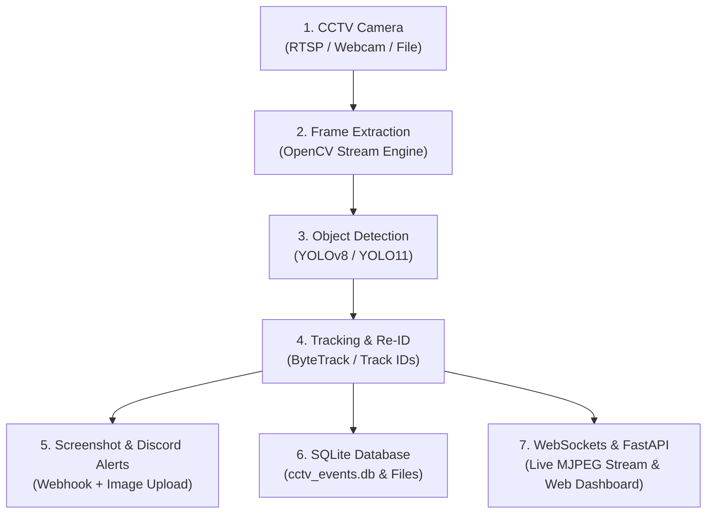

# 🛡️ AI CCTV Person Detection & Real-Time Security Sentinel


An intelligent, real-time computer vision security monitoring system built with **FastAPI**, **Ultralytics YOLO**, **OpenCV**, **WebSockets**, and **SQLite**. 

Detects human presence, maintains tracking IDs across frames, captures high-resolution screenshot snapshots, logs event metadata into SQLite, dispatches instant rich **Discord Webhook alerts with attached screenshots**, and streams live video to a **responsive glassmorphism web dashboard**.

---

## 🌟 Key Features

- **🎥 Multi-Source Stream Input**: Seamlessly process local USB Webcams (`0`, `1`), custom **RTSP Stream URLs** (`rtsp://user:pass@ip:port/stream`), or pre-recorded video files.
- **🧠 YOLO Detection & Identity Tracking**: Powered by Ultralytics YOLO (`yolo26n.pt` / `yolov8n.pt`) with persistent object tracking (`persist=True`). Prevents alert spam for the same target person.
- **⚡ Bi-Directional WebSockets (`/ws`)**: Instant real-time push updates for new detection alerts and zero-polling FPS/performance metrics.
- **🚨 Discord Webhook Notifications**: Rich formatted Discord embed alerts featuring Camera Name, Track ID, Confidence Rating, Timestamp, and direct image attachment uploads.
- **💾 SQLite Persistent Event Database**: Automatically logs event metadata (`cctv_events.db`) and screenshot files into `/screenshots`. Includes auto-seeding logic.
- **📱 Responsive Glassmorphism Web Dashboard**: Modern UI designed with HTML5, Vanilla CSS3, and Lucide icons. Fully optimized for both Desktop and Mobile viewports.
- **🔄 FastAPI Navigation Redirects**: Direct HTTP 303 Redirect handlers (`/redirect/event/{id}`, `/redirect/start`, `/redirect/stop`) for seamless navigation and deep linking.

---

## 🏛️ System Architecture



---

## 🛠️ Technology Stack

| Domain | Technologies |
| :--- | :--- |
| **Core Language** | Python 3.10+ |
| **Computer Vision** | OpenCV (`opencv-python`) |
| **Deep Learning & Tracking** | Ultralytics YOLO (`ultralytics`) |
| **Web Framework** | FastAPI, Starlette |
| **Real-Time Push & Streaming**| WebSockets (`/ws`), MJPEG Streaming (`multipart/x-mixed-replace`) |
| **Templating & UI** | Jinja2, HTML5, Vanilla CSS3, Lucide Icons |
| **Database & Persistence** | SQLite3, Pydantic |
| **Alert Notifications** | Discord Webhooks (`requests`) |

---

## 🚀 Quick Start Guide

### Prerequisites
- Python 3.10 or higher installed on your machine.
- Git installed.

### 1. Clone the Repository
```bash
git clone https://github.com/jitendradoriya66/cctv-person-detector-ai.git
cd cctv-person-detector-ai
```

### 2. Create and Activate Virtual Environment
```bash
# Windows
python -m venv venv
.\venv\Scripts\activate

# macOS / Linux
python3 -m venv venv
source venv/bin/activate
```

### 3. Install Dependencies
```bash
pip install -r requirements.txt
```

### 4. Configure Environment Variables (Optional)
Create a `.env` file in the root directory:
```env
DISCORD_WEBHOOK_URL=https://discord.com/api/webhooks/YOUR_WEBHOOK_ID/YOUR_WEBHOOK_TOKEN
```

### 5. Launch the Server
```bash
python main.py
```
Open your browser and navigate to:
👉 **[http://127.0.0.1:8000](http://127.0.0.1:8000)**

---

## 📡 API & WebSocket Reference

### Dashboard & Video Streaming
- `GET /`: Renders the responsive Jinja2 Web Dashboard.
- `GET /video_feed`: MJPEG live video stream generator.
- `WS /ws`: Bi-directional WebSocket endpoint for live alerts & performance metrics.

### REST Endpoints
- `POST /api/start-camera`: Starts background camera stream (`{ "source": 0, "confidence": 0.5 }`).
- `POST /api/stop-camera`: Stops active background camera stream.
- `GET /api/status`: Returns current system metrics, FPS, active in-frame count, and DB statistics.
- `GET /api/events`: Retrieves paginated detection history from SQLite.
- `DELETE /api/events/{event_id}`: Deletes a specific event record.
- `DELETE /api/events`: Clears all event history.
- `POST /api/settings`: Updates system configurations (Discord URL, Camera Name).
- `POST /api/test-discord`: Triggers a test Discord alert.

### Redirect Handlers
- `GET /redirect/event/{event_id}`: Redirects client to dashboard with target event modal highlighted.
- `GET /redirect/start`: Triggers stream start and redirects to dashboard.
- `GET /redirect/stop`: Triggers stream stop and redirects to dashboard.

---

## ☁️ Cloud Deployment (Render)

### Deploying to Render
1. Create a new **Web Service** on [Render](https://dashboard.render.com/).
2. Connect your GitHub repository `jitendradoriya66/cctv-person-detector-ai`.
3. Set the build settings:
   - **Environment**: `Python 3`
   - **Build Command**: `pip install -r requirements.txt`
   - **Start Command**: `uvicorn main:app --host 0.0.0.0 --port $PORT`
4. **Important Notes**:
   - **Camera Stream**: Cloud instances (Render) cannot access local USB webcams (`0`). Use an **RTSP Stream URL** (e.g. `rtsp://admin:pass@ip:554/stream`) in settings.
   - **Persistence**: Attach a **Render Persistent Disk** to retain screenshot files (`/screenshots`) and SQLite DB (`cctv_events.db`).

---

## 📜 License

Distributed under the MIT License. See `LICENSE` for more details.
