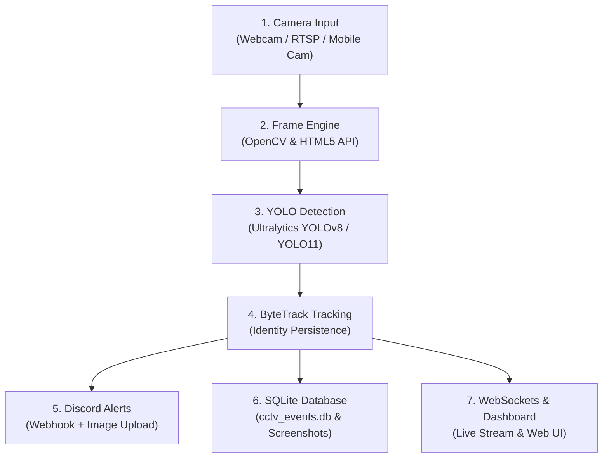

# 🛡️ AI CCTV Person Detection & Real-Time Security Sentinel


An enterprise-grade, real-time computer vision security monitoring system built with **FastAPI**, **Ultralytics YOLO**, **OpenCV Headless**, **ByteTrack**, **WebSockets**, and **SQLite**. 

Detects human presence, tracks target identities across video frames, generates high-resolution screenshot archives, logs detection metadata in SQLite, dispatches instant **Discord Webhook alerts with embedded image uploads**, and streams live video to a **mobile-responsive glassmorphism web dashboard**.

---

## 🌟 Latest Code Updates & Feature Highlights

### 📱 1. Direct HTML5 Smartphone Camera Capture
- **Browser Camera Streaming**: Allows any smartphone (Android / iPhone) or laptop browser to stream its built-in camera directly to the AI backend via `navigator.mediaDevices.getUserMedia` and `POST /api/process-frame`.
- **Live Bounding Box Overlay**: Renders real-time YOLO person detection bounding boxes, confidence ratings, and tracking IDs directly on your mobile screen.

### ⚡ 2. Bi-Directional WebSockets (`/ws`)
- **Instant Alert Push**: Detection events (`NEW_EVENT`) are pushed live over WebSockets to all connected browsers.
- **Audio Alarm Chime**: Plays a synthesized Web Audio API alarm sound whenever a new person is detected.
- **Dynamic Gallery Prepending**: Automatically prepends new screenshot cards to the top of the event history grid with glowing entry animations.
- **Zero-Polling Performance**: FPS and in-frame person counts update in real-time without HTTP polling overhead.

### 🎥 3. End-to-End Dynamic Stream Switching
- **5 Flexible Source Options**:
  1. **Option 1**: WebCam 0 / Auto Cloud Demo
  2. **Option 2**: Secondary USB Camera (1)
  3. **Option 3**: Demo CCTV Stream 1 (Pedestrian Traffic)
  4. **Option 4**: Demo CCTV Stream 2 (People Detection)
  5. **Option 5**: Smartphone Camera (Browser Cam)
  6. **Option 6**: Custom RTSP / Video Stream URL
- **Seamless Parameters**: Adjusting source dropdowns or confidence sliders instantly updates the stream engine via AJAX without full-page browser reloads.

### 🛠️ 4. Robust Cloud Fallback & Zero 0-Byte Video Engine
- **Smart Linux Device Inspection**: Mutes low-level OpenCV C++ warnings on cloud servers (Render) by checking `/dev/video0` availability before invocation.
- **Instant Placeholder Generator**: Initializes stream byte buffers with dark slate placeholder frames (*"AI CCTV Stream Initializing..."*), ensuring `/video_feed` **never** yields 0 bytes or broken image icons.

### 🔄 5. FastAPI Navigation Redirect Handlers
- **`GET /redirect/event/{id}`**: Deep-link HTTP 303 Redirect handler opening the dashboard with the target event highlighted in the image viewer modal.
- **`GET /redirect/start` & `GET /redirect/stop`**: Programmatic stream control routes.

---

## 🏛️ Architecture Blueprint



---

## 🛠️ Technology Stack

| Component | Library / Tool |
| :--- | :--- |
| **Language** | Python 3.10+ |
| **Framework** | FastAPI, Starlette |
| **Computer Vision** | OpenCV Headless (`opencv-python-headless`) |
| **AI Inference & Tracking** | Ultralytics YOLO, `lapx` (ByteTrack) |
| **Real-Time Push** | WebSockets (`ws://`, `wss://`) |
| **Frontend UI** | HTML5, Vanilla CSS3 (Glassmorphism), Jinja2, Lucide Icons |
| **Storage & Logging** | SQLite3, Pydantic |
| **Notifications** | Discord Webhooks (`requests`) |

---

## 🚀 Quick Start Guide

### 1. Clone the Repository
```bash
git clone https://github.com/jitendradoriya66/cctv-person-detector-ai.git
cd cctv-person-detector-ai
```

### 2. Create and Activate Virtual Environment
```bash
# Windows
python -m venv venv
.\venv\Scripts\activate

# macOS / Linux
python3 -m venv venv
source venv/bin/activate
```

### 3. Install Dependencies
```bash
pip install -r requirements.txt
```

### 4. Run the Application
```bash
python main.py
```
Open your browser and navigate to:
👉 **[http://127.0.0.1:8000](http://127.0.0.1:8000)**

---

## 📡 API & WebSocket Reference

### Dashboard & Video Streaming
- `GET /`: Serves the responsive Jinja2 Web Dashboard.
- `GET /video_feed`: MJPEG live video stream generator.
- `WS /ws`: Bi-directional WebSocket endpoint for live alerts & performance metrics.

### REST APIs
- `POST /api/start-camera`: Starts/restarts stream (`{ "source": "demo1", "confidence": 0.5 }`).
- `POST /api/stop-camera`: Stops active stream processing.
- `POST /api/process-frame`: Accepts raw HTML5 browser camera frames from smartphones.
- `GET /api/status`: Returns FPS, in-frame counts, and database statistics.
- `GET /api/events`: Retrieves paginated detection history.
- `DELETE /api/events/{event_id}`: Deletes a specific event.
- `DELETE /api/events`: Clears all history.
- `POST /api/settings`: Saves Discord Webhook URL and Camera Name.
- `POST /api/test-discord`: Sends a test alert to Discord.

### Redirect Handlers
- `GET /redirect/event/{id}`: Redirects to dashboard home with target event modal open.
- `GET /redirect/start`: Programmatic stream start redirect.
- `GET /redirect/stop`: Programmatic stream stop redirect.

---

## ☁️ Cloud Deployment (Render)

### Deploying to Render
1. Create a **Web Service** on [Render](https://dashboard.render.com/).
2. Connect your GitHub repository `jitendradoriya66/cctv-person-detector-ai`.
3. Set the build parameters:
   - **Environment**: `Python 3`
   - **Build Command**: `pip install -r requirements.txt`
   - **Start Command**: `uvicorn main:app --host 0.0.0.0 --port $PORT`
4. **Environment Variables**:
   - Go to **Environment** tab in Render.
   - Add `DISCORD_WEBHOOK_URL` = `https://discord.com/api/webhooks/...`
5. **Persistence**: Attach a **Render Persistent Disk** to retain screenshot archives (`/screenshots`) and SQLite DB (`cctv_events.db`).

---

## 📜 License

Distributed under the MIT License. See `LICENSE` for details.
