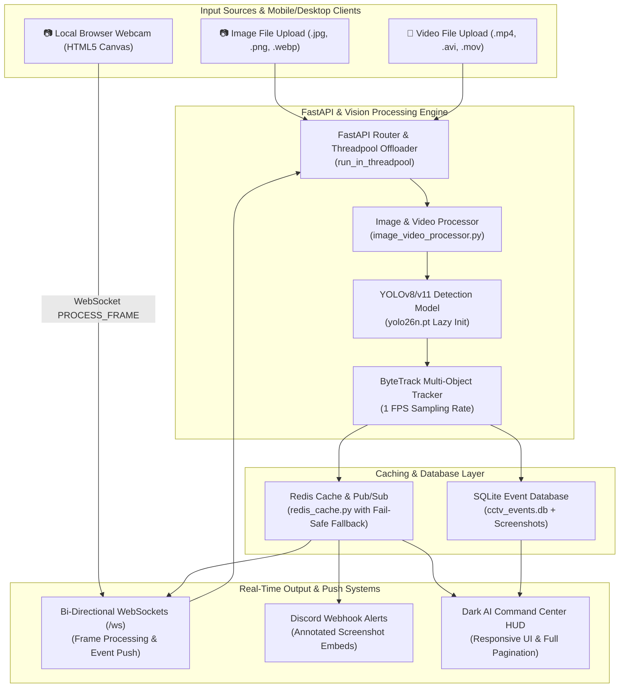

# 🛡️ AI Visual Security & Threat Detection System


An enterprise-grade, cloud-optimized **AI Visual Security & Threat Detection System** built with **FastAPI**, **Ultralytics YOLO**, **ByteTrack**, **Redis Caching**, **Bi-Directional WebSockets**, and a **Dark AI Command Center Web Dashboard**.

Optimized specifically for **Render Cloud Deployments (CPU free-tier instances)** without relying on heavy continuous live video streams, while supporting static **Image Analysis**, **Sampled Video Tracking (1 FPS)**, and **Live Webcam Capture**.

---

## 🏛️ End-to-End System Architecture


```mermaid
flowchart TD
    subgraph Clients["Input Sources & Mobile/Desktop Clients"]
        A1["📷 Image File Upload (.jpg, .png, .webp)"]
        A2["🎥 Video File Upload (.mp4, .avi, .mov)"]
        A3["📷 Local Browser Webcam (HTML5 Canvas)"]
    end

    subgraph Backend["FastAPI & Vision Processing Engine"]
        B1["FastAPI Router & Threadpool Offloader\n(run_in_threadpool)"]
        B2["Image & Video Processor\n(image_video_processor.py)"]
        B3["YOLOv8/v11 Detection Model\n(yolo26n.pt Lazy Init)"]
        B4["ByteTrack Multi-Object Tracker\n(1 FPS Sampling Rate)"]
    end

    subgraph Storage["Caching & Database Layer"]
        C1["Redis Cache & Pub/Sub\n(redis_cache.py with Fail-Safe Fallback)"]
        C2["SQLite Event Database\n(cctv_events.db + Screenshots)"]
    end

    subgraph Out["Real-Time Output & Push Systems"]
        D1["Bi-Directional WebSockets (/ws)\n(Frame Processing & Event Push)"]
        D2["Discord Webhook Alerts\n(Annotated Screenshot Embeds)"]
        D3["Dark AI Command Center HUD\n(Responsive UI & Full Pagination)"]
    end

    A1 --> B1
    A2 --> B1
    A3 -->|WebSocket PROCESS_FRAME| D1
    B1 --> B2
    D1 --> B1
    B2 --> B3
    B3 --> B4
    B4 --> C1 & C2
    C1 --> D1 & D2 & D3
    C2 --> D3
```

---

## 🌟 Key Features

### 📷 1. Static Image AI Inference
- Accepts image file uploads (`.jpg`, `.png`, `.webp`).
- Performs YOLO person detection, annotates bounding boxes & confidence scores (`Person 92%`).
- Captures screenshot evidence, logs database event (`source_type='IMAGE'`), and sends Discord notifications.

### 🎥 2. Sampled Video Tracking (ByteTrack)
- Accepts video file uploads (`.mp4`, `.avi`, `.mov`).
- Applies configurable **1 FPS frame sampling rate** (specifically optimized for lightweight CPU compute on free Render instances).
- Tracks unique Person IDs frame-to-frame using **ByteTrack**, capturing keyframe evidence screenshots per track ID.

### 🔌 3. Bi-Directional WebSocket Frame Streaming
- Web browser webcam frames are transmitted directly over the `/ws` WebSocket connection (`PROCESS_FRAME` JSON payload).
- Eliminates HTTP fetch request spam entirely during webcam capture.
- Server responds instantly over WebSocket with `FRAME_PROCESSED` data.

### ⚡ 4. Redis Caching with Automatic Fail-Safe Fallback
- Integrates `redis_cache.py` for high-performance caching of paginated events and system metrics (`stats`).
- Automatic cache invalidation on event creation or deletion.
- **Fail-safe Fallback**: If Redis server is not running or unreachable, the system automatically falls back to local SQLite & memory operations without crashing or throwing errors.

### 🎨 5. Dark AI Command Center Dashboard & Full Pagination
- Tactical Cyberpunk HUD aesthetic (Obsidian background `#050811`, Cyan glows `#00F0FF`, Emerald green `#10B981`, Threat red alerts `#FF2E54`).
- **Mobile Responsive Layout**: Touch-friendly horizontal scroll tab bar, 100% width cards, and scaling stat metrics.
- **Full Backend & Frontend Pagination**: Paginated API (`/api/events?page=1&limit=12`) with `[ Prev ]`, `Page X of Y`, and `[ Next ]` controls.
- **Custom Confirmation Modals**: Every destructive action (deleting single event `#ID` or clearing all logs) prompts a custom confirmation modal before executing.

---

## 🛠️ Technology Stack

| Layer | Technology | Version | Purpose |
| :--- | :--- | :--- | :--- |
| **Language** | Python | `3.11.9` | Primary Backend |
| **Web Framework** | FastAPI / Starlette | `>=0.108.0` | Async REST & WebSocket API |
| **ASGI Server** | Uvicorn (Standard) | `>=0.25.0` | Production Web Server |
| **Computer Vision** | OpenCV Headless | `>=4.8.0.76` | Image Decoding & Annotation |
| **AI Detection** | Ultralytics YOLO | `>=8.3.0` | Person Detection Model |
| **Tracking Engine** | ByteTrack (`lapx`) | `>=0.5.5` | Multi-Object Track ID Persistence |
| **Caching / PubSub**| Redis | `>=5.0.0` | High-Performance Event Cache & Fallback |
| **Real-Time Push** | WebSockets (`wsproto`, `websockets`) | `>=12.0` | Bi-directional Push & Frame Stream |
| **Database** | SQLite3 / Pydantic | Built-in | Event Logs & System Configuration |
| **Frontend UI** | HTML5, CSS3, JS, Jinja2, Lucide | Built-in | Dark AI Command Center Dashboard |
| **Notifications** | Discord Webhooks | `>=2.31.0` | Real-time Threat Alert Messages |

---

## 🚀 Quick Start Guide (Local Development)

### 1. Clone Repository & Install Dependencies
```bash
git clone https://github.com/jitendradoriya66/cctv-person-detector-ai.git
cd cctv-person-detector-ai/cctv_ai
pip install -r requirements.txt
```

### 2. Run Integration Test Suite
```bash
python test_suite.py
```

### 3. Launch Application Server
```bash
python main.py
```
Open your browser at: 👉 **[http://127.0.0.1:8000](http://127.0.0.1:8000)**

---

## 📡 Complete API & WebSocket Reference

### Dashboard & WebSockets
- `GET /`: Serves the Dark AI Command Center UI.
- `WS /ws`: Bi-directional WebSocket endpoint. Accepts `{ "type": "PROCESS_FRAME", "frame": "<base64>" }` and broadcasts `{ "type": "NEW_EVENT" }` and `{ "type": "FRAME_PROCESSED" }`.

### REST APIs
- `POST /api/upload-image`: Accepts image file upload, executes YOLO detection, returns annotated image URL & metrics.
- `POST /api/upload-video`: Accepts video file upload, samples frames at 1 FPS, applies ByteTrack tracking, returns keyframes & summary.
- `POST /api/process-frame`: HTTP fallback endpoint for single frame processing.
- `GET /api/status`: Returns system status and Redis-cached metrics (`stats`).
- `GET /api/events?page=1&limit=12`: Returns paginated event history (`events`, `total`, `page`, `total_pages`).
- `DELETE /api/events/{event_id}`: Deletes specific event record (requires confirmation).
- `DELETE /api/events`: Clears all detection event history (requires confirmation).
- `POST /api/settings`: Updates Discord Webhook URL.
- `POST /api/test-discord`: Triggers test notification alert to Discord.

---

## ☁️ Render Cloud Deployment Guide

### Build & Run Commands on Render:
- **Runtime**: `Python 3`
- **Build Command**: `pip install -r requirements.txt`
- **Start Command**: `uvicorn main:app --host 0.0.0.0 --port $PORT`

### Environment Variables:
- `DISCORD_WEBHOOK_URL` = `https://discord.com/api/webhooks/...` (Optional)
- `REDIS_URL` = `redis://...` (Optional; system automatically falls back to SQLite/Memory if omitted)

---

## 📜 License

Distributed under the MIT License. See `LICENSE` for details.
